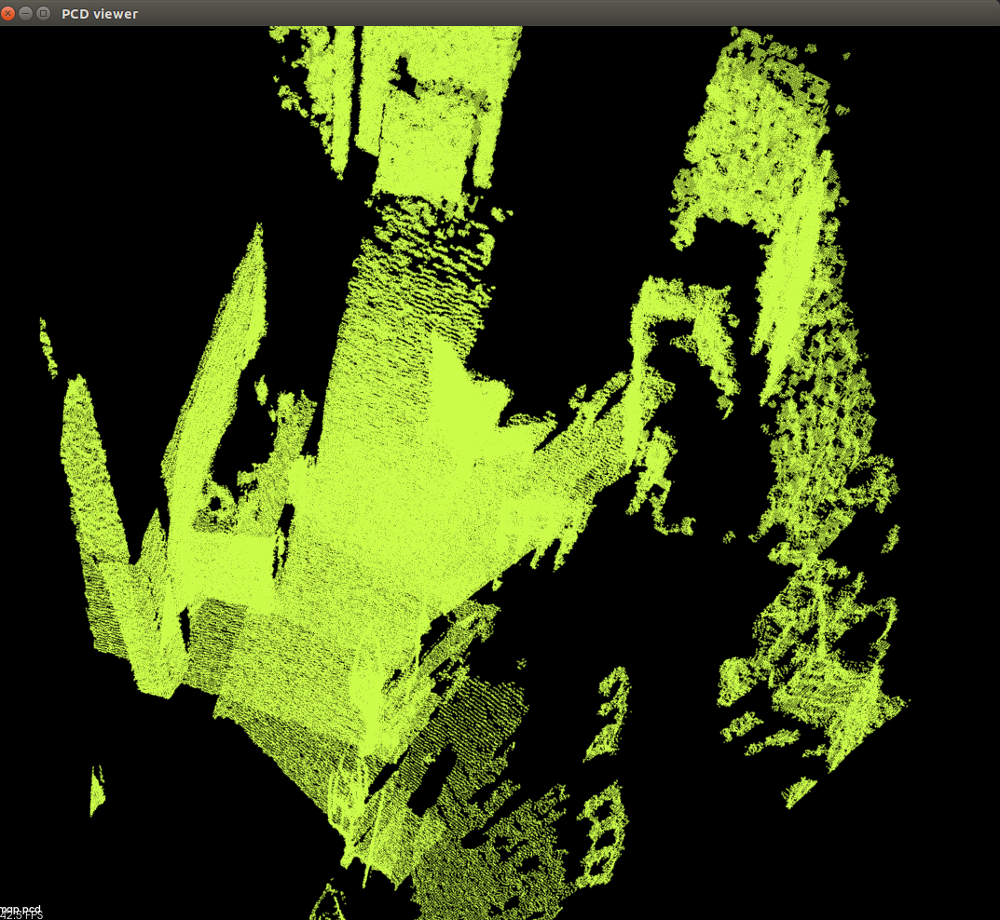
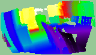

## RGBD稠密建图

```plaintext
.
├── CMakeLists.txt
├── color
│   ├── 1.png
│   ├── 2.png
│   ├── 3.png
│   ├── 4.png
│   └── 5.png
├── depth
│   ├── 1.pgm
│   ├── 2.pgm
│   ├── 3.pgm
│   ├── 4.pgm
│   └── 5.pgm
├── map.pcd
├── pcd.png
├── pose.txt
├── range_image.png
├── README.md
├── rgbd
└── src
    └── pointcloud_mapping.cpp
```
pcd图片:


range_image:
